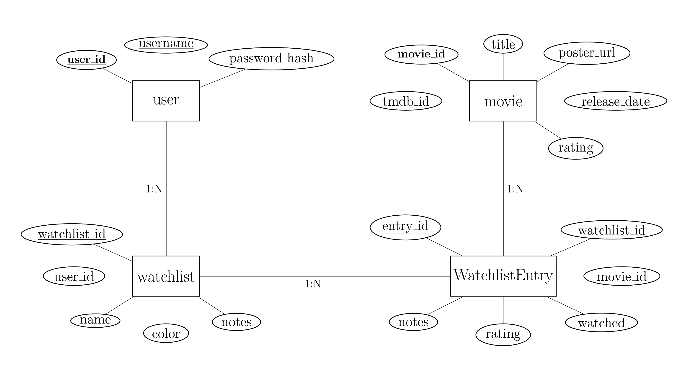

# WatchNest

WatchNest is a movie watchlist management application built using Flask. It allows users to register, log in, search for movies using the TMDB API, and manage their personalized watchlists. Users can add notes and toggle their watched status, all while enjoying a clean and modern UI.

---

## Features

- **User Authentication**: Register and log in securely using hashed passwords.
- **Movie Search**: Search for movies via the TMDB API.
- **Watchlists**: Create, update, and delete custom watchlists.
- **Movie Management**: Add movies to watchlists and mark them as watched.
- **Dark Mode**: Toggle a dark mode theme with persistence.
- **Responsive UI**: Built to look great on both desktop and mobile.

---

## System Architecture

### Backend

- **Flask**: Python framework for the backend.
- **Flask-SQLAlchemy**: ORM for managing database models.
- **SQLite**: Lightweight database for local development.
- **TMDB API**: Integration for fetching movie data.

### Frontend

- **HTML/Jinja2**: Template engine for rendering dynamic pages.
- **CSS**: Custom styles with light and dark mode support.
- **JavaScript**: Handles interactivity and AJAX requests.

---

## Database Schema and ERD

The database schema for WatchNest is modeled as follows:


- **User**:
  - `user_id` (Primary Key)
  - `username` (Unique)
  - `password_hash`

- **Movie**:
  - `movie_id` (Primary Key)
  - `tmdb_id` (Unique)
  - `title`
  - `poster_url`
  - `release_date`
  - `rating`

- **Watchlist**:
  - `watchlist_id` (Primary Key)
  - `name`
  - `color`
  - `user_id` (Foreign Key: User)
  - `notes`

- **WatchlistEntry**:
  - `entry_id` (Primary Key)
  - `watchlist_id` (Foreign Key: Watchlist)
  - `movie_id` (Foreign Key: Movie)
  - `notes`
  - `rating`
  - `watched`



---

## Setup Instructions

### Prerequisites

- Python 3.8+
- Flask and required libraries (see `requirements.txt`)
- TMDB API Key

### Installation Steps

1. **Clone the Repository**:
   ```bash
   git clone https://github.com/nadanova/WatchNest.git
   cd WatchNest
   ```

2. **Set Up Virtual Environment**:
   ```bash
   python -m venv venv
   source venv/bin/activate  # On Windows: venv\Scripts\activate
   ```

3. **Install Dependencies**:
   ```bash
   pip install -r requirements.txt
   ```

4. **Configure Environment Variables**:
   Create a `.env` file in the project root and add your TMDB API key:
   ```
   TMDB_API_KEY=your_tmdb_api_key
   SECRET_KEY=your_secret_key
   ```

5. **Initialize the Database**:
   ```bash
   flask shell
   >>> from app import db
   >>> db.create_all()
   >>> exit()
   ```

6. **Run the Development Server**:
   ```bash
   flask run
   ```

   The app will be available at `http://127.0.0.1:5000`.

---

## Folder Structure

```
WatchNest/
├── app.py             # Main Flask application
├── models.py          # Database models
├── static/            # Static files (CSS, JS, Images)
│   ├── css/
│   ├── js/
├── templates/         # HTML templates
├── requirements.txt   # Python dependencies
├── README.md          # Project documentation
├── .env.example       # Example environment variables
```

---

## Usage

1. Navigate to `http://127.0.0.1:5000`.
2. Register a new account or log in with an existing one.
3. Use the search bar to find movies and add them to your watchlists.
4. Manage your watchlists, add notes, and toggle watched status.

---

## License

This project is licensed under the MIT License.
